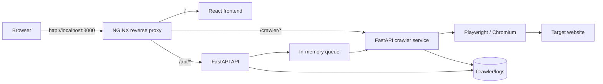

# Snigel Crawler

Snigel Crawler is a web application for checking a publisher's Snigel/Adngin integration. It opens the supplied pages in Playwright, performs desktop and mobile checks, validates `ads.txt` entries, stores CSV logs, and presents a summarized report in a React UI.

## What it checks

- page title and basic page availability;
- CMP/GDPR provider detection and consent acceptance;
- TCF consent string retrieval;
- presence and URL structure of Snigel `loader.js`;
- network requests for `loader.js` and `adngin.js`;
- presence of `window.snigelPubConf`;
- order of `snigelPubConf` and `loader.js` in the HTML source;
- loaded Adngin modules;
- Adngin and Prebid console warnings/errors;
- Adngin debug mode;
- requested entries in the site's `ads.txt` file;
- homepage and optional article page in desktop and mobile contexts.

## Architecture



The application consists of four Docker Compose services:

| Service | Purpose | Host port |
| --- | --- | --- |
| `nginx` | Public entry point and reverse proxy | `3000` |
| `frontend` | React production build served by NGINX | internal `3000` |
| `crawler-api` | Authentication, queue, history, logs, and feedback API | `8000` |
| `crawler` | Runs Playwright and generates crawl results | `8001` |

## Requirements

- Docker Desktop with Docker Compose v2;
- Git, if cloning the repository;
- internet access during the first build and while crawling external sites.

The first build is relatively large because the Playwright image includes browser binaries.

## Quick start with Docker

### 1. Clone the repository

```bash
git clone https://github.com/MFoks/crawler.git
cd crawler
```

### 2. Create the environment file

```bash
cp .env.example .env
```

Edit `.env` and set all values:

```dotenv
JWT_SECRET=replace-with-a-long-random-secret
ADMIN_USERNAME=admin
ADMIN_PASSWORD=replace-with-a-strong-password
```

On macOS or Linux, a JWT secret can be generated with:

```bash
openssl rand -hex 32
```

The `.env` file is ignored by Git and must never be committed.

### 3. Build and start the application

```bash
docker compose up --build -d
```

Check whether all services are healthy:

```bash
docker compose ps
```

Open [http://localhost:3000](http://localhost:3000) and sign in with `ADMIN_USERNAME` and `ADMIN_PASSWORD` from `.env`.

### 4. Stop the application

```bash
docker compose down
```

To stop the application and also remove its locally built images:

```bash
docker compose down --rmi all --remove-orphans
```

This does not delete the source code or files stored in `Crawler/logs`.

## Using the application

1. Sign in.
2. Enter the homepage URL. The homepage is required.
3. Optionally enter an article/subpage URL.
4. Optionally select **Add ads.txt entries** and provide entries that should exist in the site's `ads.txt`.
5. Select **Run**.
6. Watch the queue state and live CSV log output.
7. When the crawl finishes, open **Feedback** or download the CSV file.

For each supplied page, the crawler creates separate desktop and mobile browser contexts. If an article URL is not supplied, only the two homepage scans are performed.

## Crawl request format

The frontend sends the following JSON to the API:

```json
{
  "homepage": "https://example.com",
  "article": "https://example.com/article",
  "adsEntries": [
    "example.com, 12345, DIRECT"
  ]
}
```

Only `homepage` is required.

## API authentication

The API uses an HS256 JWT token with a six-hour lifetime. The frontend saves the token and its expiry time in browser `localStorage`.

Public endpoints:

| Method | Endpoint | Purpose |
| --- | --- | --- |
| `GET` | `/` | API identity response |
| `GET` | `/health` | Container healthcheck |
| `POST` | `/login` | Validate credentials and return a JWT |
| `POST` | `/crawler-finished` | Internal callback used by the crawler service |

Protected endpoints require `Authorization: Bearer <token>`:

| Method | Endpoint | Purpose |
| --- | --- | --- |
| `GET` | `/verify-token` | Validate the current JWT |
| `POST` | `/trigger-crawler` | Add a crawl request to the queue |
| `GET` | `/crawler-status?domain=...` | Read file status and active/queue state |
| `GET` | `/crawler-logs?domain=...` | Return the newest CSV log as lines |
| `GET` | `/download-logs?domain=...` | Download the newest CSV log |
| `GET` | `/history` | Return up to 50 recent UI history entries |
| `POST` | `/history` | Add a UI history entry |
| `GET` | `/crawler-feedback?domain=...` | Return ads.txt issues and parsed crawl feedback |
| `GET` | `/queue-status` | Return active jobs, queue length, and configured limit |

Through the reverse proxy these endpoints are available under `/api`, for example `/api/login`. Direct FastAPI documentation is available while the services are running at:

- API: [http://localhost:8000/docs](http://localhost:8000/docs)
- crawler service: [http://localhost:8001/docs](http://localhost:8001/docs)

## Queue behavior

`CrawlerAPI/main.py` contains an in-memory `asyncio.Queue`. A background task accepts queued domains and calls the crawler service. `MAX_CONCURRENT_CRAWLERS` is currently set to `3` and is displayed by the UI.

The current queue processor has one consumer and waits for each crawler HTTP request to finish before taking the next item. As a result, jobs are effectively processed sequentially even though the configured active-job cap is three. Queue contents are not persisted across an API container restart.

## Output files

Runtime output is written under `Crawler/logs/`, which is mounted into both Python services.

| Path | Contents |
| --- | --- |
| `Crawler/logs/<domain>_<date>_<time>.csv` | Full crawl log for one run |
| `Crawler/logs/<domain>.status` | Current file status, normally `pending` or `done` |
| `Crawler/logs/crawler_history.json` | Last 50 history entries shown by the UI |
| `Crawler/logs/modulesinfo/<domain>_<timestamp>.json` | Adngin module configuration captured from the page |

Logs and generated runtime files are excluded from Git.

## Project structure

```text
.
├── Crawler/                 # Playwright runner and crawler HTTP service
│   ├── app.py               # FastAPI wrapper around the runner
│   ├── main.py              # Main synchronous Playwright crawl flow
│   ├── debug_crawler.py     # Standalone diagnostic/debug runner
│   ├── shared/              # Individual checks, logging, and feedback
│   ├── utils/               # Page orchestration and ads.txt helpers
│   └── tests/               # Basic Playwright test script and URL list
├── CrawlerAPI/
│   └── main.py              # Authenticated public API and queue
├── front-crawler/
│   ├── public/              # Static assets
│   └── src/                 # React/TypeScript application
├── nginx/
│   └── nginx.conf           # Routes frontend, API, and crawler traffic
├── .env.example              # Safe configuration template
└── docker-compose.yml        # Full application stack
```

## Backend function map

### `CrawlerAPI/main.py`

| Function | Responsibility |
| --- | --- |
| `extract_domain` | Extract a hostname from a URL or domain value. |
| `sanitize_filename` | Convert a domain into a safe status/log filename. |
| `create_token` | Create a six-hour HS256 JWT. |
| `verify_token` | Decode and validate a JWT. |
| `get_current_user` | FastAPI dependency that enforces bearer authentication. |
| `process_crawler_queue` | Consume queued payloads, call the crawler service, and track active domains. |
| `startup_event` | Start the queue processor when FastAPI starts. |
| `login` | Validate the configured admin credentials and return a token. |
| `trigger_crawler` | Validate a request, create a `pending` status file, and enqueue it. |
| `crawler_status` | Return status-file, active-job, and queue information. |
| `crawler_finished` | Internal callback that changes a domain status to `done`. |
| `crawler_logs` | Read the newest CSV log for a domain. |
| `download_logs` | Return the newest CSV as a downloadable response. |
| `get_history` / `add_history` | Read and update the latest 50 UI history entries. |
| `crawler_feedback` | Extract missing ads.txt entries and request detailed feedback from the crawler service. |
| `queue_status` | Return active domains and current queue metrics. |

### `Crawler/app.py`

| Function | Responsibility |
| --- | --- |
| `extract_domain` / `sanitize_filename` | Normalize a domain for file lookup. |
| `build_log_path` | Find the newest matching crawl CSV, preferring the current minute. |
| `run_crawler` | Run `main.py` as a subprocess, parse its log into feedback, and notify the API when finished. |
| `get_feedback` | Generate structured feedback for the newest domain log. |

### `Crawler/main.py`

| Function/section | Responsibility |
| --- | --- |
| `create_urls_file_from_domain` | Normalize the homepage/article and create homepage, article, and ads.txt URLs. |
| `read_urls_from_file` | Validate and read the temporary URL file. |
| main execution block | Initialize CSV logging, launch Chromium, run desktop/mobile page checks, and validate ads.txt. |

The main runner uses four possible contexts in this order:

1. homepage desktop;
2. homepage mobile;
3. article desktop, when an article is supplied;
4. article mobile, when an article is supplied.

`Crawler/debug_crawler.py: run_debug` is a standalone diagnostic path that prints additional browser, console, request, CMP, Adngin, and screenshot information while investigating a target site. It is not called by the web application.

### `Crawler/utils/`

| File/function | Responsibility |
| --- | --- |
| `page.py: check_page` | Orchestrate all checks performed against one Playwright page. |
| `ads_txt.py: check_ads_txt` | Fetch `/ads.txt` and verify every requested entry. |
| `home_page.py: check_home_page` | Small standalone/legacy homepage helper; it is not called by the primary `main.py` flow. |

### `Crawler/shared/`

| File/function | Responsibility |
| --- | --- |
| `logger_csv.py` | Create the per-run CSV, append labeled messages, and expose its current path. |
| `check_title.py: check_title` | Read the document title. |
| `check_gdpr.py: check_gdpr` | Detect Sourcepoint, Google FC, Snigel, Didomi, OneTrust, Cookiebot, Quantcast, or a generic TCF CMP. |
| `accept_gdpr.py: accept_gdpr` | Click a known consent button in the document. |
| `accept_gdpr.py: handle_sourcepoint_iframe` | Handle consent inside a Sourcepoint iframe. |
| `get_tcf_object.py: get_tcf_object` | Query the detected CMP for its TCF consent string. |
| `get_tcf_string.py: get_tcf_string` | Log the final TCF string or retrieval failure. |
| `check_script_source.py: check_script_in_source` | Validate the Snigel `loader.js` URL and flag dev/staging/master variants. |
| `check_request.py: check_request` | Attach a request listener and verify a Snigel `loader.js` network request. |
| `check_snigelpubconf.py: check_snigelpubconf` | Check `snigelPubConf` in both `window` and HTML source. |
| `check_order_in_source.py: check_order_in_source` | Ensure `snigelPubConf` appears before `loader.js`. |
| `check_request_adngin.py: check_request_adngin` | Detect `adngin.js` requests and experiment markers. |
| `get_adngin_modules.py: get_adngin_modules` | Save `adngin.cmd.getConfig().modules` as JSON. |
| `check_adngin_logs.py: check_adngin_logs` | Capture relevant Adngin/Snigel console errors and warnings. |
| `capture_adngin_logs.py: capture_adngin_logs` | Print raw Adngin console messages; retained as an auxiliary listener and not called by the primary flow. |
| `capture_prebid_logs.py: capture_prebid_logs` | Capture relevant Prebid console errors, warnings, no-bids, and timeouts. |
| `capture_adngin_warning_logs.py` | Parse detailed Adngin debug warnings and missing containers. |
| `capture_prebid_warning_logs.py` | Reserved placeholder for a dedicated Prebid warning listener; currently empty. |
| `enable_debug.py: enable_debug` | Call `adngin.cmd.enableDebug()`, reload, and allow debug messages to arrive. |
| `feedback/generate_feedback.py` | Convert the newest CSV and module JSON into UI-friendly feedback and diagnostics. |
| `loggers/check_cmp_issues.py` | Deduplicate a known missing-USP-API message. |
| `loggers/check_missing_ad_units.py` | Parse missing ad-container messages. |
| `log_function.py` | Optional decorator for recording function execution; not used in the primary crawl flow. |
| `check_imp_order.py` | Experimental impression-order helper; not used in the primary crawl flow. |

## Frontend function map

| File/component | Responsibility |
| --- | --- |
| `src/App.tsx` | Define `/login` and protected `/app-crawler` routes. |
| `src/LoginForm.tsx` | Submit credentials and redirect after successful login. |
| `src/AuthGuard.tsx` | Validate the saved token before rendering the crawler page. |
| `src/api.ts` | Store/clear tokens and provide authenticated `GET`/`POST` wrappers. |
| `src/CrawlerPage/CrawlerPage.tsx` | Main UI state, crawl submission, queue polling, log polling, feedback, history, and CSV download. |
| `src/CrawlerPage/CrawlerHistory.tsx` | Display recent crawl history. |
| `src/CrawlerPage/AdsTxTPopUp.tsx` | Collect expected ads.txt entries used by the active page. |
| `src/CrawlerPage/AdsTxt.tsx` | Alternative ads.txt modal component; currently not imported by `CrawlerPage`. |
| `src/CrawlerPage/ExecutionLogs.tsx` | Render live crawl log lines. |
| `src/CrawlerPage/FeedbackModal.tsx` | Present ads.txt issues, page checks, diagnostics, and Adngin modules. |
| `src/CrawlerPage/LoadingSpinner.tsx` | Reusable loading indicator; currently not imported by the main page. |
| `src/CrawlerPage/DomainInput.tsx` | Reusable domain input; currently not imported by the main page. |
| `src/CrawlerPage/StatusMessage.tsx` | Reusable status renderer; currently not imported by the main page. |

The UI polls crawl status every five seconds, logs every two seconds, and queue information every five seconds.

## Running only the core crawler locally

Docker is the recommended way to run the full stack. For direct debugging of the Playwright runner:

```bash
cd Crawler
python3 -m venv .venv
source .venv/bin/activate
pip install -r requirements.txt
playwright install chromium
python3 main.py '{"homepage":"https://example.com"}'
```

With an article and ads.txt entries:

```bash
python3 main.py '{"homepage":"https://example.com","article":"https://example.com/article","adsEntries":["example.com, 12345, DIRECT"]}'
```

This writes output directly to `Crawler/logs` but does not start the API or frontend.

## Development commands

Frontend development server:

```bash
cd front-crawler
npm install
npm start
```

This starts the React development server only. The frontend uses relative `/api/*` URLs, so API calls still require a compatible development proxy. For normal end-to-end work, use the Docker Compose stack and its NGINX routing.

Frontend checks:

```bash
npm test
npm run build
```

Useful Docker commands:

```bash
# Follow all logs
docker compose logs -f

# Follow one service
docker compose logs -f crawler-api
docker compose logs -f crawler

# Rebuild one service
docker compose build crawler-api

# Restart the stack after rebuilding
docker compose up -d
```

## Troubleshooting

### Docker daemon is not running

Start Docker Desktop, wait until its engine is ready, and retry `docker compose up --build -d`.

### A service is unhealthy

```bash
docker compose ps
docker compose logs --tail=200 <service-name>
```

Valid service names are `crawler`, `crawler-api`, `frontend`, and `nginx`.

### Port already in use

The stack requires host ports `3000`, `8000`, and `8001`. Stop the conflicting process or change the published port in `docker-compose.yml`.

### The first build takes a long time

This is expected. Docker must download the Playwright base image and browser dependencies. Later builds should reuse cached layers.

### Login fails after changing `.env`

Recreate the API container so that it receives the new environment values:

```bash
docker compose up -d --force-recreate crawler-api
```

### Reset the project containers

```bash
docker compose down --remove-orphans
docker compose up --build -d
```

## Security notes

- Never commit `.env`.
- Use a long random `JWT_SECRET` and a strong admin password.
- The current user store contains one environment-configured admin account and is intended for internal tooling, not public multi-user deployment.
- CORS currently allows all origins. Restrict it before exposing the API publicly.
- `/crawler-finished` is intended for internal service communication but currently has no authentication of its own.
- Put TLS and appropriate access controls in front of the application before deploying it outside a trusted network.
